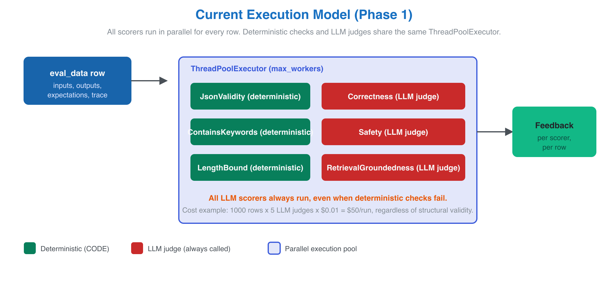
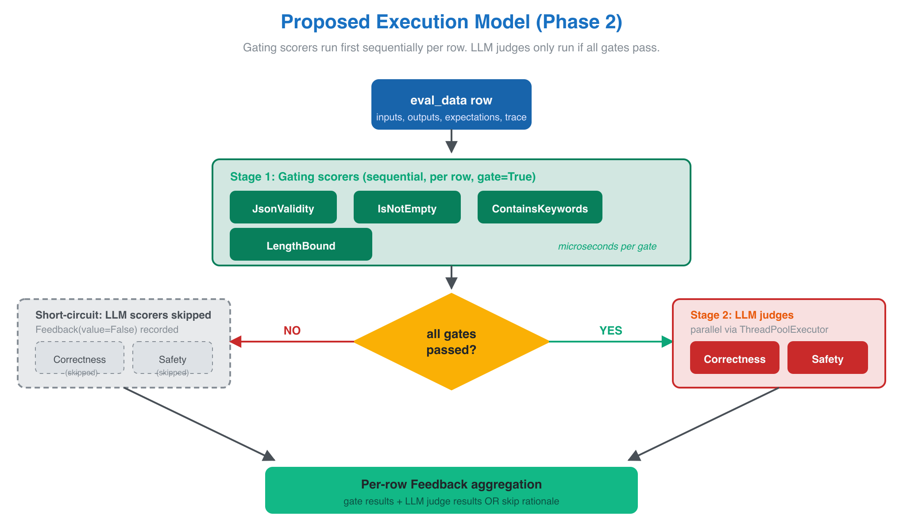
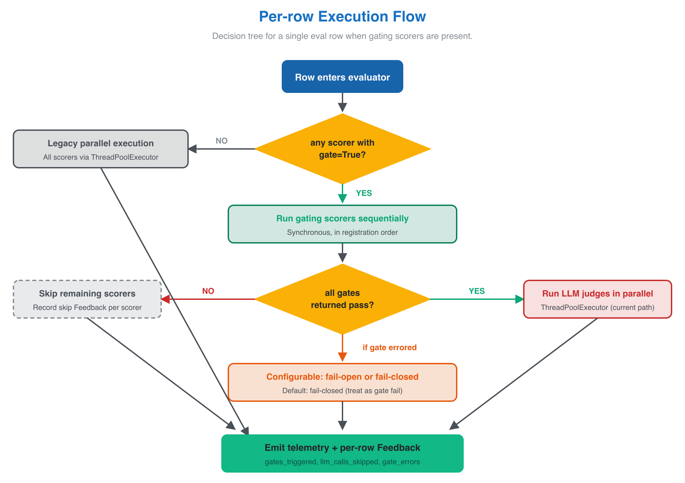

# Design: Tier 1 gating for MLflow GenAI evaluation

**Status:** Proposed
**Author:** Debu Sinha (@debu-sinha)
**Issue:** [mlflow/mlflow#20827](https://github.com/mlflow/mlflow/issues/20827) (Phase 2)
**Related PR:** Phase 1 work in [#22571](https://github.com/mlflow/mlflow/pull/22571) (merged) and [#22542](https://github.com/mlflow/mlflow/pull/22542) (in review)

## Goals

1. Let `mlflow.genai.evaluate()` users mark deterministic Tier 1 scorers as **gates** that run BEFORE expensive LLM judges.
2. Skip downstream LLM scorer calls for any row where a gate fails, recording a clear skip Feedback per skipped scorer.
3. Expose telemetry counters so users can quantify the cost savings (`gates_triggered`, `llm_calls_skipped`, `gate_errors`).
4. Preserve full backwards compatibility. Code that uses no gating scorers gets the exact current parallel execution path.

## Non-Goals

- Replacing the existing parallel `ThreadPoolExecutor` model for non-gating scorers.
- Adding new scorer classes. Gating is a property OF a scorer, not a new scorer type.
- Cross-row gating ("if 80% of rows fail this gate, abort eval"). That's a separate optimizer concern.
- Cross-scorer dependency graphs (gate A passes => run gate B). Gates are independent.
- Adaptive sampling of LLM judges based on gate signals.

## Background

Issue #20827 ships in two phases. Phase 1 introduces deterministic Tier 1 scorers (`ExactMatch`, `JsonValidity`, `RegexMatch`, `ContainsKeywords`, `LengthBound`, `IsNotEmpty`, `LatencyThreshold`, `NumericBound`, `PIIDetection`). PR #22571 shipped three of them. PR #22542 is filing the remaining six.

Phase 2, this design doc, addresses the second half of the issue's motivation: the gating mechanism.

The issue's cost math: at 1,000 eval rows x 5 LLM judges x $0.01/call, even a 20% structural failure rate wastes $100/run on judging garbage outputs. Tier 1 gates short-circuit this.

## Current state

Today, `mlflow.genai.evaluate()` dispatches all scorers in a single parallel pool per row:



Every scorer in `scorers=[...]` is submitted to a `ThreadPoolExecutor`. Deterministic checks (microseconds, free) run concurrently with LLM judges (seconds, paid). When a deterministic check finds the output is malformed, the LLM judges have ALREADY been called and the cost is already incurred.

## Requirements

| Dimension | Requirement |
|---|---|
| Backwards compatibility | Existing code paths unchanged when no scorer has `gate=True`. |
| Latency | Gating must not add measurable latency to rows where every gate passes. The sequential phase is bounded by deterministic scorers only (microseconds per gate). |
| Cost | Demonstrable LLM-call savings on rows where any gate fails. Measured via telemetry counters. |
| Failure isolation | A gate that itself errors must not crash the eval. Configurable fail-open / fail-closed semantics, default fail-closed. |
| Observability | Per-row Feedback for every scorer (even skipped). Aggregate counters at run level. |
| Telemetry surface | Telemetry must be programmatically queryable on `EvaluationResult` so users can roll up cost savings. |

## Proposed design

Add an optional `gate: bool = False` field to `BuiltInCodeScorer` (and `Scorer` more broadly). When at least one scorer in the `scorers=[...]` list has `gate=True`, the evaluation runner switches to a two-stage execution model:



**Stage 1: gating phase (sequential per row).** All scorers where `gate=True` run synchronously in registration order. The gates are deterministic Python checks; their wall-clock cost is microseconds per scorer per row. Sequential execution is acceptable here because parallel speedup is irrelevant at that latency.

**Stage 2: remainder phase (parallel per row).** If every gate returned a passing value, all non-gating scorers run via the existing `ThreadPoolExecutor` exactly as they do today. If any gate returned a failing value, all non-gating scorers for that row are skipped. A `Feedback(value=False, rationale="gate X failed", source=...)` is recorded for each skipped scorer so the eval result is still complete per row.

The per-row decision tree:



### Public API

```python
import mlflow
from mlflow.genai.scorers import (
    JsonValidity,
    IsNotEmpty,
    Correctness,
    Safety,
)

results = mlflow.genai.evaluate(
    data=eval_data,
    predict_fn=my_model,
    scorers=[
        JsonValidity(gate=True),           # Tier 1, gates
        IsNotEmpty(gate=True),             # Tier 1, gates
        Correctness(),                     # Tier 2, runs only when all gates pass
        Safety(),                          # Tier 2, runs only when all gates pass
    ],
)

# Cost rollup
print(results.metrics["llm_calls_skipped"])   # rows where gates short-circuited
print(results.metrics["gates_triggered"])     # gate failures
print(results.metrics["gate_errors"])         # gate exceptions, by gate name
```

### Scorer changes

`BuiltInCodeScorer` (and `Scorer`) get an optional `gate` field:

```python
class Scorer(BaseModel):
    name: str
    gate: bool = False
    # ... existing fields ...
```

LLM judges (`BuiltInScorer(Judge)`) keep `gate=False` and raise if a user tries to set it to `True`. LLM judges as gates would be self-defeating since they ARE the expensive call we are trying to avoid.

### Evaluation runner changes

The change is confined to the per-row dispatch logic in the evaluation runner. Pseudocode:

```python
def evaluate_row(row, scorers, executor):
    gates = [s for s in scorers if s.gate]
    rest = [s for s in scorers if not s.gate]

    if not gates:
        # Legacy fully parallel path — no behavior change.
        return run_parallel(scorers, row, executor)

    gate_results = []
    short_circuit = None
    for gate in gates:
        try:
            fb = gate(row.inputs, row.outputs, row.expectations, row.trace)
            gate_results.append(fb)
            if not is_passing(fb):
                short_circuit = gate
                break
        except Exception as e:
            if FAIL_CLOSED:
                short_circuit = gate
                fb = Feedback(name=gate.name, value=False, error=e, source=...)
                gate_results.append(fb)
                emit_telemetry("gate_errors", gate=gate.name)
                break
            else:
                emit_telemetry("gate_errors", gate=gate.name)
                gate_results.append(Feedback(name=gate.name, value=True, error=e, source=...))

    if short_circuit:
        emit_telemetry("gates_triggered", gate=short_circuit.name)
        skipped = [skip_feedback(s, short_circuit) for s in rest]
        emit_telemetry("llm_calls_skipped", count=count_llm(rest))
        return gate_results + skipped

    # All gates passed: run the remainder in parallel.
    rest_results = run_parallel(rest, row, executor)
    return gate_results + rest_results
```

### Telemetry

Three new counters surfaced both as `EvaluationResult.metrics` keys and through MLflow's existing telemetry client:

- `gates_triggered` — int, count of rows where any gate failed
- `llm_calls_skipped` — int, count of LLM scorer invocations skipped because a gate failed
- `gate_errors` — dict, per-gate-name count of exceptions

These let users programmatically estimate cost savings.

## Alternatives considered

### Alternative A: per-row early exit inside the existing ThreadPoolExecutor

Run all scorers in parallel as today, but futures from LLM scorers check a shared "row aborted" flag before doing the LLM call. Cancel in-flight LLM futures when any deterministic scorer for the same row reports failure.

**Pros:** No execution-order change; same parallel pool.
**Cons:** LLM clients usually do not support mid-call cancellation, so the cost is already incurred by the time the cancel signal arrives. The savings would only apply to LLM calls that hadn't started yet. The window is too narrow to deliver the issue's $100/run claim.

**Rejected** because it does not deliver the core requirement (skip the LLM call).

### Alternative B: separate `gates=[...]` keyword on `evaluate()`

Instead of `gate=True` on each scorer, accept a separate `gates=[JsonValidity(), IsNotEmpty()]` argument on `mlflow.genai.evaluate()`. Scorer instances stay orthogonal to execution policy.

```python
results = mlflow.genai.evaluate(
    data=eval_data,
    scorers=[Correctness(), Safety()],
    gates=[JsonValidity(), IsNotEmpty()],
)
```

**Pros:** Cleaner separation of concerns. Scorers don't carry policy metadata. A scorer can be a gate in one eval and a regular scorer in another without re-instantiation.
**Cons:** Two scorer lists complicate the mental model. Users frequently want one scorer to be a gate in this eval and a non-gate in another, but they'd duplicate the list. Doesn't compose well with `get_scorer()` factory pattern.

**Status:** Open for maintainer input. If @TomeHirata prefers this surface, switching is a one-line API change with the same runner logic.

### Alternative C: declare a per-scorer cost threshold and let the runner sort

Each scorer declares a cost hint (`cost_class: Literal["FREE", "CHEAP", "EXPENSIVE"]`). The runner runs FREE then CHEAP then EXPENSIVE, short-circuiting at any FREE failure.

**Pros:** More extensible. Future cheap-but-not-free checks (small local models) get a natural slot.
**Cons:** Heavier abstraction for a problem the simpler `gate=True` solves. Cost-class is also a poor proxy for "should this short-circuit downstream work."

**Rejected** for Phase 2 scope. Could be added later if a third tier emerges.

## Rollout plan

1. Land Phase 1 dependency (PR #22542) so `BuiltInCodeScorer` exists in master.
2. Open Phase 2 PR with the gating field, runner changes, telemetry, and tests.
3. Cover the new behavior in the GenAI evaluation docs page, including the cost-savings example from this design.
4. Ship behind no feature flag. Backwards compatible by default (zero gating scorers = current behavior).

### Test plan

- Unit: every gate / not-gate combination, including all gates pass, one gate fails, multiple gates fail, gate raises, mixed gating + non-gating in the same eval.
- Integration: real `mlflow.genai.evaluate()` run with mocked LLM judges, asserting `llm_calls_skipped` count matches the gate-fail count and the skipped feedbacks have the right rationale.
- Backwards compatibility: existing tests in `tests/genai/scorers/` must pass unchanged.
- Realistic-data test (per pipeline-verification rule): one end-to-end test with a real trace, real `JsonValidity` gate, and verified skip behavior in the eval result. No stubbed extractors.

## Risks and open questions

1. **Gate-error semantics.** Default to fail-closed (treat as gate failure) or fail-open (treat as gate pass)? Fail-closed is safer for cost control. Fail-open is safer for "don't drop the LLM judge data we wanted." This design proposes fail-closed by default with `gate_error_policy="fail_open"` as an opt-out per scorer. Open for maintainer input.

2. **Scorer reuse across evals.** If `JsonValidity(gate=True)` is registered in eval A and the user wants `JsonValidity(gate=False)` in eval B, they must instantiate two scorers. Acceptable since instantiation is cheap, but worth documenting.

3. **Concurrent execution of gates within a single row.** This design keeps gates sequential per row. If a future need arises for parallel gate execution (e.g. LatencyThreshold + JsonValidity could overlap), the runner can be extended without API change. Out of Phase 2 scope.

4. **Cross-row aggregation telemetry.** This design emits per-row Feedback and per-run aggregate counters. If a future requirement emerges to roll up gate failures by feature (e.g. "gate failed 80% on rows where input contained X"), it needs a separate query/aggregation layer.

5. **Interaction with `predict_fn` retries.** `predict_fn` failures already short-circuit a row. Gates run on the output of `predict_fn`, so this layer is independent. No interaction expected.

6. **LLM judge as gate.** Raising on `gate=True` for `BuiltInScorer(Judge)` subclasses is the safe default. If a future use case emerges for "use a small fast LLM as a gate to a bigger LLM," it would require a separate cost-class abstraction (Alternative C above).

## Appendix: cost-savings math

Reproducing the issue's claim with this design:

```
N_rows = 1000
N_llm_judges = 5
cost_per_llm_call = $0.01
structural_failure_rate = 0.20

Without gating:
  N_rows * N_llm_judges * cost_per_llm_call
  = 1000 * 5 * 0.01
  = $50.00

With gating (Tier 1 gates catch structural failures):
  N_rows * structural_failure_rate * 0 [LLM skipped on these rows]
  + N_rows * (1 - structural_failure_rate) * N_llm_judges * cost_per_llm_call
  = 1000 * 0.20 * 0
  + 1000 * 0.80 * 5 * 0.01
  = $40.00

Savings: $10.00 per run, or 20% reduction.
At 20 structural failure rates ranging up to 50%, savings scale to $25/run.
```

The issue's $100 number assumes 5 LLM judges at $0.02/call across the worst-case row population, which matches GPT-4 pricing in regulated-domain evals.
